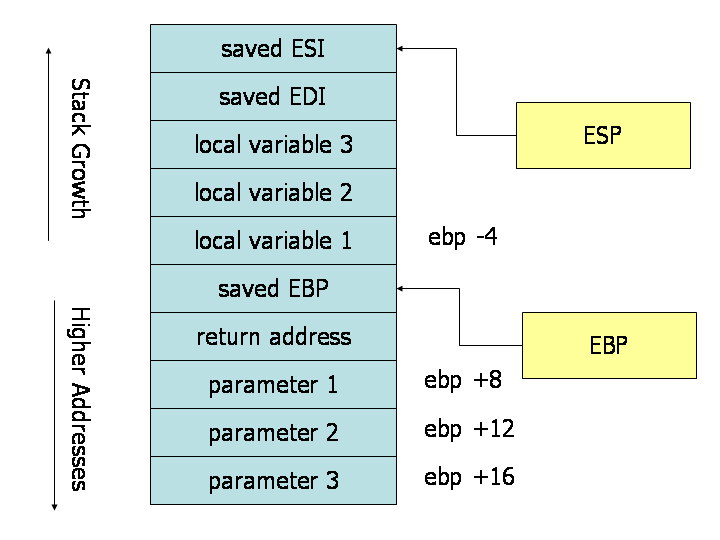

## Подготовка
Первым делом, вам необходимо поставить пакет qemu-user. Найдите в интернете
способ, как его поставить на вашу систему. Для debian ветки:
```
sudo apt install qemu-user
```
Затем запустите скрипт для установки необходимых пакетов для компиляции и
запуска arm приложений:
```
./start.sh
```

## Компиляция:
```
/usr/local/bin/arm-gcc/bin/arm-linux-gnueabi-gcc -marm prog_name.S prog_name2.c prog_name3... -o prog_name
```

## Запуск:
```
qemu-arm -L /usr/local/bin/arm-sysroot/ ./prog_name
```

## Синтаксис:
По умолчанию все вычисления происходят справа налево и результат кладется
в самый первый аргумент. Arm имеет RISC архитектуру - то есть одинаковую длину
команд. Обращаться к памяти можно только с помощью команд ldr, str.
В общем случае, передавать информацию можно только между регистрами.

## Calling convention:
Аргументы из си-функций передаются слева направо и кладутся в регистры
r0-r3. Если их не хватает, то используется стек. За процесс складывания аргументов
ответственен компилятор.

## Asm и bytecode
Все ассемблерные команды - не более, чем набор байт. Каждая команда представима
в виде опкода - определенная последовательность битов, кодирующая название
команды и информацию об аргументах. Дальше процессор по хеш таблице, где
ключом является имя команды, вызвает необходимую микрокоманду.

## Полезные материалы:
[Официальная документация по Arm арихтектуре и ассемблеру](https://developer.arm.com/documentation/dui0068/b/)

## Простыми словами о сложном
Здесь я хочу внести корректировки к сказанному
[здесь](https://github.com/victor-yacovlev/mipt-diht-caos/tree/master/practice/asm/arm_basics)
и показать, как можно искать информацию по этой теме.

Ассемблерные команды называются инструкциями, из них состоит программа.
В простейшем случае нам надо реализовать функцию, объявленную в Си коде,
но не определенную там. Для этого нужно объявить метку в ассемблерном коде
с названием, соответствующим метке (например, метка `f` из quad.S).

Внутри метки надо писать код. Если передавались аргументы из Си функции,
то они попадут соответственно в регистры r0-r3. Порядком передачи совокупно с
другими правилами обращения с регистрами в вызываемой и вызывающих функциях
называется `Calling convention` - соглашение о вызовах.

Архитектура Arm поддерживает два типа команд - Arm и Thumb. Мы будем говорить
именно про 32-х битный набор Arm. Thumb имеет меньшую длину команд - 16 бит за счет
урезанного стандартного множества команд. Такой финт позволяет сократить
размер программы.

Список команд с объяснением их работы можно найти из официальной документации
выше. Начать писать на Arm ассемблере можно уже сейчас. Следующим этапом будет
понимание устройства стека - достаточно объемной памяти по сравнению с
регистрами. О нем можно почитать [здесь](https://www.tutorialspoint.com/assembly_programming/assembly_procedures.htm#:~:text=A%20stack%20is%20an%20array,'top'%20of%20the%20stack.&text=The%20memory%20space%20reserved%20in,used%20for%20implementing%20the%20stack.).
Стек в одной картинке -


В данном разделе сайта можно найти и другую информацию про язык ассемблера, полезную
для новичков, но следует учитывать, что примеры построены на Intel x86 архитектуре.

Помимо стека, можно использовать память в куче. Но об этом уже в следующий раз.

Итак, я постарался коротко обозреть основные части программы на языке ассемблера,
чтобы вы понимали, какую информацию нужно искать.

TODO: больше примеров и материалов
