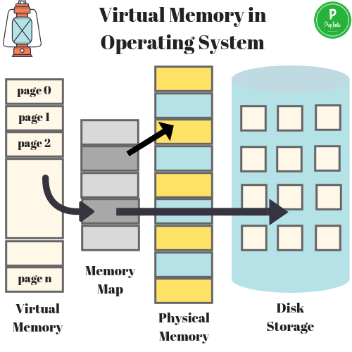

## Виртуальная память

В современных системах используемая процессом память делится на страницы - в
большинстве случаев по 4Kb. Физические страницы находятся непосредственно
на носителе и отображаются в виртуальные. Картинка ниже иллюстрирует
такое устройство. 

https://prepinsta.com/wp-content/uploads/2019/01/Virtual-Memory-in-OS-Operating-System.png

С помощью виртуальной памяти мы имеем разграничение адресных пространств
процессов. Каждая страница выделяется для конкретного процесса.
MMU (memory management unit) - кристалл в CPU - преобразовывет
виртуальный адрес в физический. Если процесс не имеет доступа на обращение
к странице, возвращается ощибка в виде исключения.

Переменные хранятся по адресам, смещенным относительно начала страницы.
Физическая страница получается многоуровневым переходам:

адрес -> страница страниц -> страница страниц -> физическая страница+смещение

### mmap

Системные вызов `mmap` необходим для отображения физической памямти, в том
числе файлов, в виртуальную процесса. Также с помощью него можно
создавать участки памяти для совместного использования несколькми
процессами - такой механизм называется shared memory. Подробнее
можно почитать в man 2 mmap. В `substrings.c` можно посмотреть пример
использования для чтения файла. В папке `malloc` содержится
пример простейшей реализации `malloc()` через `mmap`.
Конечно, для этого системного вызова есть `libc` обертка
с соответствующим названием.
 
### Screencast

[Смотреть](https://youtu.be/DmabwfSHrdc)
